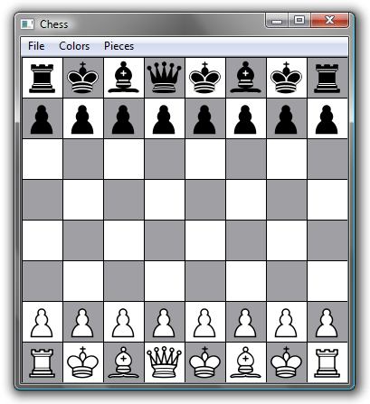

Chess
------------

Chess is simple software for creating creating SVG-format chess pieces. This is useful for publication, since SVG files can be displayed at any resolution. There is support for non-traditional chess icons—that is, not featuring crosses—if for any reason that's important to you.

The chess icons are from [Wikimedia commons](http://commons.wikimedia.org/wiki/Category:SVG_chess_pieces) (some modified slightly), which I hereby release under whatever license is necessary to make my use of them ethical.



*   Open & Save
    *   _File|Save_ to save the current puzzle
    *   _File|Open_ to open a saved puzzle
    *   File format: 64 space-delimited two-letter codes indicating the color and identity of each piece; the initial board configuration is, for instance, “BR BK BB BQ BK BB BK BR BP BP BP BP BP BP BP BP WN WN WN WN WN WN WN WN WN WN WN WN WN WN WN WN WN WN WN WN WN WN WN WN WN WN WN WN WN WN WN WN WP WP WP WP WP WP WP WP WR WK WB WQ WK WB WK WR” The WNs could be BNs.
*   Creating puzzles
    *   _File|Clear board_ for a blank board
    *   _File|Starting positions_ for a board set to the standard initial configuration
*   Colors
    *   Use the _Colors_ menu to change the colors of the squares and pieces.
    *   In SVG files, the pieces will always come out black, no matter what you choose.
*   Internationalization
    *   Use the _Pieces_ menu to choose Traditional or Secularized pieces. The secularized ones don't have crosses, and the bishop is an elephant. You do know why that is, don't you?

Downloads
---------

Chess is created with the [Qt application framework](https://www.qt.io/), released under the GNU Public License. That means, among other things, that you are free to download it and use it, but not to re-sell it.

Qt is a cross-platform framework, so there is the possibility for using this on Mac OS X, Linux, etc. Right now I only have Windows executables because I only have a Windows machine. Perhaps some do-gooder will build versions for other operating systems and send them to me.

I build in Windows with this, which assumes that Qt is installed and visible in your path:

```
qmake -config release 
mingw32-make
```

Of course your system would have something different from “mingw32-make”—probably just “make”—if you are not building from Windows using MinGW.
